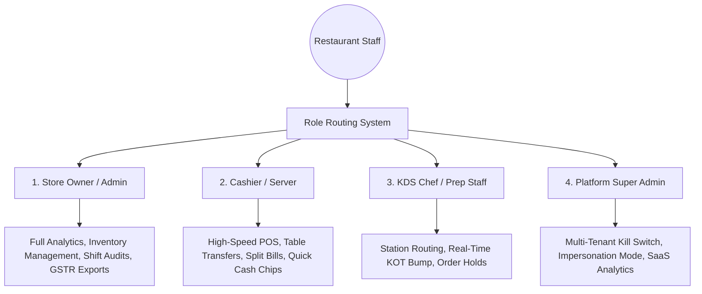

# resPOS — Product & Marketing Manifest
> **"The High-Performance, Multi-Tenant, Offline-First OS for Modern Restaurants"**  
> *A Production-Ready, Real-Time POS, KDS, & Operations Suite Built for Cafes, High-Traffic Bars, and Multi-Outlet Restaurant Chains.*

---

## 1. Executive Summary & Brand Identity

### The Vision
Managing a modern restaurant, kitchen, or multi-outlet food and beverage chain is a logistical challenge. Restaurateurs face high hardware setup costs, server latency spikes at peak dinner hours, constant table turnover delays, employee billing discrepancies, and complex split-bill calculations during busy shifts. 

**resPOS** is an enterprise-grade, multi-tenant POS and restaurant management suite built to solve these critical bottlenecks. By utilizing a hybrid offline-first architecture, it ensures your cash register never stops running even during complete internet dropouts. It combines real-time WebSockets synchronization for high-speed kitchen operations, built-in analytics, split-billing, and a high-visibility, "fat-finger" optimized touch interface that handles screen glare and high-stress hospitality environments with ease.

### Slogan & Value Hook
* **Primary Slogan:** *Running the World's Best Kitchens, Uninterrupted.*
* **Value Hook:** *Fire orders to the kitchen instantly, manage tables dynamically in real-time, and split complex group bills in seconds. Built on true offline-first resilience that works even when your Wi-Fi dies.*
* **Target Audience:** Fine-dining establishments, high-volume quick service restaurants (QSRs), multi-outlet franchise chains, cocktail bars, and modern cafes.

---

## 2. Core Value Propositions

### ⚡ True Offline-First Counter Resilience
Hospitality cannot afford downtime. If your internet connection drops during peak dinner rush, resPOS keeps working. Using a robust `IndexedDB` caching engine powered by `Dexie.js`, menus are stored locally with a 10-minute Time-To-Live (TTL). Orders are securely drafted in browser-level storage and automatically synced to the PostgreSQL backend database the instant connectivity is restored, ensuring zero double-billing or lost kitchen tickets.

### 🍽️ Real-Time Dynamic Floor & Table Management
No more manual check-ins or server confusion. resPOS features an interactive, zone-categorized visual floor plan. Tables are color-coded in real-time (`AVAILABLE` in green, `OCCUPIED` in indigo, `BILLED` in amber, `DIRTY` in slate) powered by persistent WebSockets. Staff receive instant visual updates the moment a table fires a new course, requests the bill, or is cleared for the next party.

### 🚀 Dual-View Fat-Finger Touch Interface
A busy POS counter demands speed. resPOS is optimized for high-intensity, harsh lighting and screen glare with its **High-Contrast Light Theme**. It features two layouts:
1. **Terminal Scan Mode:** Large, structured visual grid buttons (minimum touch target size of 44-48px) designed for rapid touch screen operations.
2. **Terminal List View:** A clean, compact list-based view for desktop terminals to process long corporate orders swiftly.

### 🍳 Real-Time Kitchen Display System (KDS) Live Sync
Bid farewell to lost thermal slips. The KDS module splits fired tickets into dedicated WebSocket channels based on the preparation station (e.g., *Hot Kitchen*, *Bar*, *Desserts*). Chefs view incoming order sequences instantly on high-contrast tickets, modify statuses, and "bump" (mark served) tickets using an optimistic UI that syncs with cashiers instantly.

### 📊 Indian GST Compliance & Intra/Inter-State Taxation
Built natively for the Indian restaurant ecosystem. resPOS features a dynamic GST engine that automatically parses tax guidelines (CGST/SGST for intra-state dining, IGST for inter-state deliveries) at the line-item level. It supports custom HSN code mapping and simplifies tax season with one-click, structured GSTR-1/3B-ready spreadsheet exports.

### 🛡️ Immutable Security Audit Engine
Loss prevention is a top priority for restaurant owners. resPOS features an immutable, detailed audit logging engine. Sensitive actions (such as `VOID_BILL`, `REFUND`, `PRICE_OVERRIDE`, and `DELETE_ITEM`) are strictly logged with the cashier's identity, timestamps, table states, and a mandatory text reason, exposing high-risk cash drawer discrepancies instantly.

### 🧠 "Usual Order" Frequency CRM Intelligence
Reward returning customers with lightning-fast service. The POS integrates an analytical customer profile manager that computes a real-time $O(N)$ frequency map of settled orders. The moment a customer's phone number is entered, the POS suggests their "Usual Order" (top items, custom modifiers, and seat preferences), cutting order entry time down to under 5 seconds.

---

## 3. Role-Based Feature Deep-Dive

resPOS is structured around four highly specialized operational roles to manage and run full-scale restaurant operations seamlessly.



### 1. Store Owner (Admin Dashboard)
* **Real-time Overview:** Centralized dashboard tracking active tables, hourly sales velocity, payment channel splits (UPI, Cash, Card, Wallet), and average table turn time.
* **Smart Analytics Widgets:** Embedded ML forecasting, food cost alert banners (warning when ingredient prices spike against recipe margins), and table-turn heatmaps.
* **Staff Performance & Shifts:** Dedicated shift management tool to audit cash drawer variances, adjust opening float levels, review cash flow, and export daily Z-Reports.
* **HSN/GST Tax Module:** Configure item tax brackets and export clean spreadsheets containing CGST, SGST, and IGST breakdowns for accountants.

### 2. Cashier / Server (POS Terminal)
* **Visual Floor Plan:** Instantly seat guests, transfer active bills from Table A to Table B (`PATCH /orders/:id/transfer`), and track table cleaning queues.
* **Zustand-Powered Cart:** Supports adding item modifiers, custom instructions (e.g., *"No onions, extra spicy"*), seat assignments for fine dining, and holding or firing courses (Appetizers, Mains, Desserts).
* **Multi-Channel Split Payments:** Split complex group bills by item, by seat, or simple equal percentages. Settle tabs with "Quick-Cash" chips and instant change calculators.
* **Aggregator Ingestion:** Integrates direct webhook sync for Zomato/Swiggy. Incoming orders auto-fire KOTs to the KDS, matching menu categories instantly without manual cashier input.

### 3. KDS Chef (Kitchen Display System)
* **Optimistic Ticket Interaction:** Mark preparation phases (`PENDING`, `HELD`, `FIRED`, `PREPARED`) with instant, zero-lag visual feedback.
* **WebSocket Isolation:** Kitchen terminals only receive tickets routed to their designated station rooms (preventing the bar from getting grilled-chicken tickets).
* **Bump Sequence:** Bumping a completed KOT immediately triggers a cashier notification and pushes real-time sync metrics to calculate Chef prep times.

### 4. Platform Super Admin (SaaS Portal)
* **Impersonation Mode:** Platform developers can instantly generate a support bypass JWT to "Act As" any tenant to troubleshoot active database records.
* **Tenant Lifecycle Control:** SaaS platform dashboard to monitor tenant onboarding, calculate total GMV processing fees, and toggle tenant access with a global "Kill Switch."
* **System-Wide Alerts:** Publish real-time global system alerts to all active tenant terminals instantly.

---

## 4. Technical Innovation & Code Showcase

### A. IndexedDB Caching & Offline Syncer
Rather than querying the backend API for every menu category rendering, resPOS maintains an offline-first menu cache in IndexedDB.
* **Core Logic:** When the POS page loads, it fetches the menu and caches it locally. If a network disconnect is detected, the UI falls back to IndexedDB.
* **Order Draft Sync:** When offline, checkouts are stored in local storage drafts. An automatic listener checks network status and fires sequential updates when connection returns:
```typescript
// Conceptual Sync Engine matching resPOS architecture
async function syncOfflineOrders() {
  const drafts = await getLocalStorageDrafts();
  if (drafts.length === 0) return;
  
  for (const draft of drafts) {
    try {
      const response = await fetch('/api/v1/orders/offline-sync', {
        method: 'POST',
        headers: { 'Content-Type': 'application/json' },
        body: JSON.stringify(draft),
      });
      if (response.ok) {
        await removeLocalDraft(draft.id);
      }
    } catch (err) {
      console.error("Sync failed for draft: ", draft.id, err);
      break; // Stop loop to preserve chronological order
    }
  }
}
```

### B. Atomic Inventory Deductions via PostgreSQL `$transaction`
To prevent concurrent race conditions where two cashiers order the last remaining premium steak, resPOS runs raw recipe ingredient deductions atomically.
* **Mechanism:** Firing a KOT invokes `InventoryService` which executes an atomic transaction. It reads the recipe requirements, calculates absolute gram/unit deductions, and updates current ingredient stock levels. If stock drops below safe margins, it fires an instant KDS and Owner dashboard alert.

### C. Multi-Channel Split Payments Algorithm
The split-billing engine calculates tax and item divisions accurately, supporting split-by-percentage or split-by-item setups:
```typescript
interface SplitPaymentRequest {
  orderId: string;
  splits: {
    amount: number; // in paise to avoid rounding issues
    method: 'CASH' | 'CARD' | 'UPI' | 'COMPLIMENTARY';
  }[];
}
```
Amounts are handled at the database level in integer **paise** (e.g., ₹10.50 is stored as `1050`) to eliminate floating-point rounding errors across split tickets.

---

## 5. Marketing Assets & Promotional Copy

### High-Converting Social Media / WhatsApp Ad Copy (Hinglish/English Hybrid)

> **Headline:** 🍽️ Ek Peak Dinner Rush aur Aapka POS Counter Hang Ho Gaya? 🤦‍♂️🚨
> 
> *Customer bill ke liye wait kar raha hai, kitchen mein chef ko pata nahi chal raha kaunsa order pehle banana hai, aur aap counters ke beech bhag rahe hain?*  
> 
> Chhodiye wahi purane aur dabba billing software ko! Apne restaurant, cafe ya bar ko dijiye Next-Gen Speed **resPOS** ke saath!
> 
> ✅ **Wi-Fi Band? Billing Chalegi!** resPOS sacha offline-first system hai. Internet band hone par bhi bill banega, kitchen print niklega, aur data internet aane par apne aap sync ho jayega!  
> ✅ **Real-Time KDS (Kitchen Display System):** KOT ka jhanjhat khatam. Cashier ke 'Fire' dabaate hi kitchen screen par order flash hoga instantly!  
> ✅ **Smart Table & Floor Plan:** Konse table par bill ban gaya hai, konsa khali hai, aur konsa dirty hai — sab live dikhega aapke screen par color-codes ke sath.  
> ✅ **Group Bills Split Karein Seconds Mein:** Ek click mein bill ko split kariye card, cash aur UPI mein bina kisi calculative error ke!  
> ✅ **Aggregator Webhook Integration:** Zomato aur Swiggy ke orders direct aapke POS aur kitchen mein enter honge bina kisi double-entry ke.  
> 
> ⚡ **Modern. High-Contrast. Touch-Screen Friendly.**  
> Setup is completely free!
> 
> 👉 **Aaj hi apna Restaurant demo book karein:** WhatsApp us at +91 9500018008 or visit respos.in 🚀

---

### Cold Outreach Script (WhatsApp or Email for Restaurant Owners)

> **Subject:** Double your table turn-around time & stop kitchen leakage 🚀
> 
> Hello [Owner Name],
> 
> Running a restaurant like [Restaurant Name] is extremely rewarding, but managing peak dinner hours without order delays or billing discrepancies can be incredibly stressful.
> 
> Most restaurants lose up to **8% of their daily revenue** due to slow billing terminals, table turnover delays, or unrecorded kitchen voids.
> 
> That’s why we built **resPOS** — a high-performance, offline-first restaurant management suite designed to keep your kitchen running at peak speed.
> 
> **Here is how we help you maximize your restaurant's profits:**
> 
> 1. **Zero-Latency Real-time KDS:** Orders are routed directly to specific kitchen preparation screens (Hot Kitchen, Bar) instantly via WebSockets, reducing wait times by **18%**.
> 2. **Bulletproof Offline Resilience:** If your internet drops, your POS keeps billing, scanning, and printing without a single glitch. Everything auto-syncs when online.
> 3. **Dynamic Table & Floor Management:** Keep track of Available, Occupied, Billed, and Dirty tables with a live, color-coded visual layout.
> 4. **Unified Billing & Split Payments:** Let guests settle bills by split-items, split-seats, or custom percentages across UPI, Card, and Cash in seconds.
> 5. **Anti-Theft Auditing:** Track every voided KOT, discount override, or cash-drawer discrepancy back to the specific staff member with mandatory reason codes.
> 
> We can set up resPOS for your outlet in less than an hour, and your staff will learn it in minutes. 
> 
> Would you be open to a quick 5-minute interactive demo at your outlet this week?
> 
> Best regards,  
> **resPOS Team**  
> 📞 +91 9500018008  
> 🌐 respos.in

---

### Comparative Analysis: resPOS vs. Traditional POS

| Feature | Legacy PC POS (Tally/Busy/Local Softwares) | Tablet POS Apps (Petpooja/Dotpe) | resPOS |
| :--- | :--- | :--- | :--- |
| **Downtime Resilience** | High maintenance, no real cloud sync | Completely breaks down if Wi-Fi goes offline | **True Offline-First (Dexie.js / IndexedDB Auto-Syncer)** |
| **Real-Time KDS Sync** | None (Requires kitchen thermal printers) | Medium (Polling based, prone to lag) | **Zero-lag WebSocket Rooms (Hot Kitchen, Bar)** |
| **Split Billing Engine** | Complex, requires manual cashier math | Basic split by percentage only | **Advanced splitting (By Item, By Seat, or Percentage)** |
| **Loss Prevention** | Logs deletions but no manager overrides | Simple transaction logs | **Immutable Security Audit Engine with mandatory reasons** |
| **Hardware Required** | Heavy PCs, expensive proprietary setups | Tablets or specific proprietary machines | **Zero Hardware Lock (Runs on any Touch Terminal, iPad, PC)** |
| **Customer Intelligence** | Basic name/phone logs | Simple history | **Usual Order Intelligence (O(N) frequency calculations)** |
| **Aggregator Integration**| Manual entries from aggregator tablets | Basic API integrations | **Instant Webhook Sync & KDS Auto-Firing** |

---

## 6. Pricing Plans & Market Positioning

resPOS is strategically priced to fit all restaurant scales, eliminating the need for expensive upfront license fees while delivering a premium, modern experience.

### ☕ Plan 1: Core (Single Outlet Terminal)
* **Price:** ₹1,499 / month (Billed annually)
* **Best For:** Standalone cafes, bars, bakeries, and QSRs.
* **What's Included:**
  * 1 POS Terminal with high-contrast dual-view layouts.
  * Real-Time Table & Visual Floor Plan manager.
  * WebSockets KDS integration for up to 2 kitchen stations.
  * IndexedDB 10-minute cache offline capability.
  * Dynamic GST & HSN billing tax engine.
  * Split Payments (by percentage or quick cash).
  * Shift variance tracking and GSTR data exports.

### 🏢 Plan 2: Enterprise (Multi-Outlet Franchise Suite)
* **Price:** ₹3,499 / month / outlet (Billed annually)
* **Best For:** High-volume restaurant chains, multi-level fine dining, and franchise groups.
* **What's Included:**
  * Everything in the **Core Plan** for unlimited terminals.
  * Unlimited KDS Station Routing (Hot Kitchen, Bar, Grill, Pantry, Dessert).
  * Direct Zomato & Swiggy webhook integrations.
  * Automated GSTR-1/3B spreadsheet and GSTR sandbox readiness.
  * Immutable Security Audit Logs with Super Admin remote impersonation.
  * Integrated CRM with $O(N)$ Usual Order intelligence algorithms.
  * Priority 24/7 dedicated support manager.

---

> [!TIP]
> **Pitching Focus for Promoters:** When selling resPOS to a busy restaurateur, **never lead with "it creates bills."** Lead with **speed, security, and uptime.** Explain how the KDS saves chef preparation time, how the offline mode prevents chaos when the internet cuts out, and how split-billing clears busy tables faster during weekend rushes.
